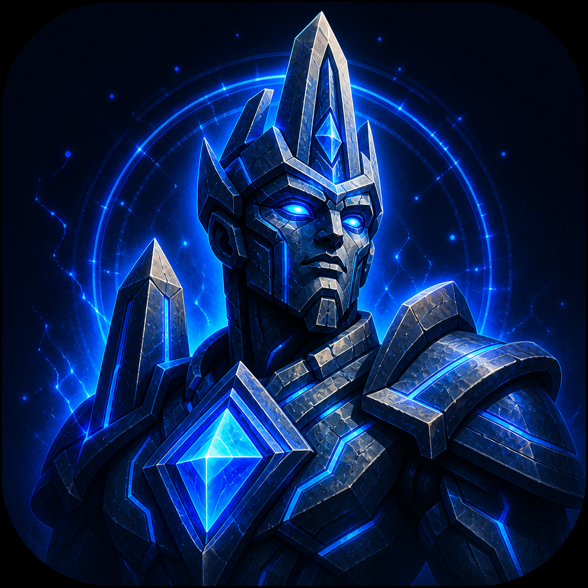

  

<h1 align="center">Obelisk</h1>

  <em>Your repo finally maintains itself.</em>

  
  
  

---

Obelisk is an open-source desktop app that runs AI coding agents against your GitHub repos. It writes features, fixes bugs, files issues with repro steps, runs Playwright QA, and reviews pull requests — on a schedule, in the background, while you do other things.

Connect a repo, choose which agents to enable, set how much they're allowed to do, and let them work. Everything runs locally on your machine through the Claude Code CLI or Codex CLI. Your code and API keys never leave your machine.

## Agents

| Agent | What it does |
|---|---|
| **QA Hunter** | Reads code, runs the test suite, and files GitHub issues for likely bugs and weak coverage. |
| **Manual QA** | Drives the app with Playwright against a written QA Playbook and files issues with traces, screenshots, console output, and network logs. |
| **Bug Fixer** | Picks a labeled issue, writes a failing test, fixes it, and opens a draft pull request. |
| **Feature Builder** | Takes a one-line issue and ships a tested feature end-to-end: spec → plan → build → test → review → PR. |
| **PR Reviewer** | Reviews every pull request for correctness, design, tests, security, and performance. |

## How it works

| | |
|---|---|
| **App** | Electron + React desktop app. Runs on your machine. |
| **CLI runner** | Claude Code CLI or Codex CLI, configurable per agent or globally. Auto-fallback if one fails. |
| **State** | Local SQLite for runs, audit logs, and backlog. OS keychain for tokens and API keys. |
| **GitHub** | OAuth Device Flow on first launch. Issues, PRs, and reviews go through the GitHub REST API. |
| **Execution** | Local subprocess by default. Optional GitHub Actions runs for unattended 24/7 schedules. |
| **Backend** | None. No hosted service, no telemetry, no multi-tenant cloud. |

## Safety levels

Each level adds the actions of the previous one.

1. **Observe only** — agents read code, run tests, and crawl the app. Findings appear in the dashboard as previews. Nothing is written to GitHub or the repo.
2. **File issues** — agents may create real GitHub issues with repro steps and suggested fixes.
3. **Fix bugs and build features** — agents may also open *draft* pull requests. A human still merges.
4. **Auto-merge safe fixes** — Obelisk may merge a green draft PR that matches a safe-fix policy.

Every agent action is recorded in an audit log detailed enough that a reviewer can verify what happened without re-running it.

## Status

Early development. The product is being built in the open. Issues and discussion are welcome.

## Documentation

| Document | Contents |
|---|---|
| [PRD.md](PRD.md) | Product requirements, scope, user flows, screens. |
| [docs/AGENT_ARCHITECTURE.md](docs/AGENT_ARCHITECTURE.md) | Agent definitions, skill library, runner interface. |
| [docs/TECH_DESIGN.md](docs/TECH_DESIGN.md) | App architecture, scheduler, state, IPC. |
| [docs/TEST_PLAN.md](docs/TEST_PLAN.md) | How Obelisk is tested. |

## License

[MIT](LICENSE).
